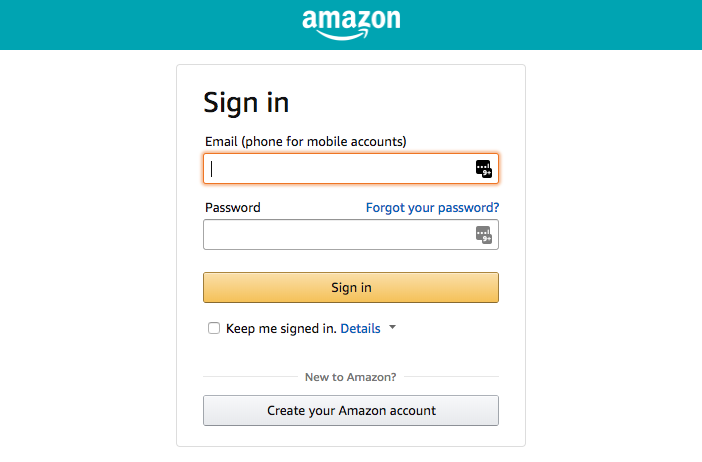
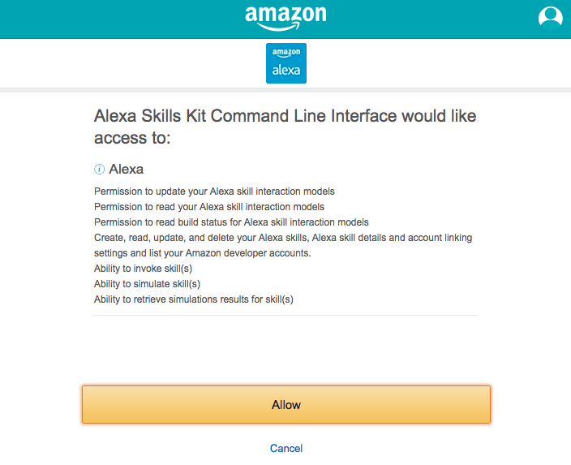

# AWS & ASK CLI Setup Guide
[AWS Account](new-aws-account.md) | [AWS CLI](aws-cli-setup-intro.html) | [AWS CLI Profile](aws-cli-setup-profile.html) | [Amazon Developer Account](dev-portal-intro.html) | [ASK CLI](ask-cli-setup-intro.html) | **[ASK CLI Profile](ask-cli-setup-profile.md)** | [Deploy a Skill](deploy-sample-skill.html)


# ASK CLI Setup - Profile

If you are here it means that you have:

✓ **An AWS Account** (if not, follow the [guide to Create a new AWS Account](new-aws-account.md))

✓ **The AWS CLI Installed** (if not, follow the [guide to install AWS CLI](aws-cli-setup-install.md))

✓ **An Amazon Developer Account** (if not, follow the [guide to Create a new Amazon Developer Account](new-dev-portal-account.md))

✓ **The ASK CLI Installed** (if not, follow the [guide to install ASK CLI](ask-cli-setup-install.md))


In this step, we will initialize a new ASK Profile and configure to be mapped to your Amazon Developer Account and the AWS CLI Profile created earlier.


The first time you use ASK CLI, you must call the `init` command to initialize the tool with your Amazon developer account credentials. For more information, see [init command](https://developer.amazon.com/docs/smapi/ask-cli-command-reference.md#init-command).

You will be prompted to name your profile, choose an AWS profile to use, and to log in to your Amazon developer account. Once the initialization is complete, you can use ASK CLI to manage your skill.


**Note** that by default, the ASK CLI will attempt to configure a name-less `default` profile for you. In this guide we will be configuring a *named* profile.


On the Terminal, execute the following command:

```
$ ask init
```


#### 1 - Select an AWS Profile 

```
-------------------- Initialize CLI --------------------
Setting up ask profile: [color-changer]
? Please choose one from the following AWS profiles for skill's Lambda function
deployment.
 (Use arrow keys)
❯ ask-user
  ──────────────
  skip AWS credential for ask-cli
  ──────────────
```


#### 2 - Log In With Amazon



#### 3 - Authorize Alexa Skills Kit CLI to access your account



#### 4 - Confirmation

```
? Please create a new profile or overwrite the existing profile.
 Create new profile
-------------------- Initialize CLI --------------------
Setting up ask profile: [default]
? Please choose one from the following AWS profiles for skill's Lambda function
deployment.
 ask-user
Switch to 'Login with Amazon' page...
Tokens fetched and recorded in ask-cli config.
Vendor ID set as M2CGMEXAMPLER0

Profile [default] initialized successfully.
```


###    🏆 **Congratulations** - You Have Completed the AWS CLI Setup! 🏆

 

## Next:  [Deploy a Sample Skill](deploy-sample-skill.md)

