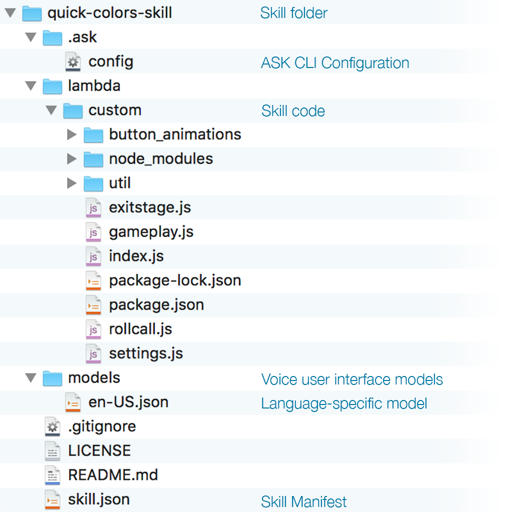

# AWS & ASK CLI Setup Guide
[AWS Account](new-aws-account.md) | [AWS CLI](aws-cli-setup-intro.md) | [AWS CLI Profile](aws-cli-setup-profile.md) | [Amazon Developer Account](dev-portal-intro.md) | [ASK CLI](ask-cli-setup-intro.md) | [ASK CLI Profile](ask-cli-setup-profile.md) | **[Deploy a Skill](deploy-sample-skill.md)**


# Colone the Sample Skill


If you are here it means that you have:

✓ **An AWS Account** (if not, follow the [guide to Create a new AWS Account](new-aws-account.md))

✓ **The AWS CLI Installed** (if not, follow the [guide to install AWS CLI](aws-cli-setup-install.md))

✓ **An Amazon Developer Account** (if not, follow the [guide to Create a new Amazon Developer Account](new-dev-portal-account.md))

✓ **The ASK CLI Installed** (if not, follow the [guide to install ASK CLI](ask-cli-setup-install.md))

✓ **An ASK CLI Profile** (if not, follow the [guide to setup a ASK CLI Profile](ask-cli-setup-profile.md))

✓ **Deployed a sample skill** (if not, follow the [guide to download deploy a sample skill](deploy-sample-skill.md))


## 1 – Clone the Color Changer Sample into a New Skill

In this step you will start making changes to the Color Changer skill to give it a different name.

Start by renaming the skill folder. In the parent folder, where you downloaded or cloned the skill, rename
 skill-sample-nodejs-buttons-colorchanger to quick-colors-skill.

On a Linux, or Mac OS X operating system, execute this command:

```bash
mv skill-sample-nodejs-buttons-colorchanger quick-colors-skill 
```

On a Windows computer, the command to rename will be

```powershell
ren skill-sample-nodejs-buttons-colorchanger quick-colors-skill 
```

After this, the skill folder structure should look like this:





> For more information on ASK CLI Configuration see CLI Setup.

> For more information on the Skill Manifest, see the [developer documentation.](https://developer.amazon.com/docs/smapi/skill-manifest.html)


## 2 – Update Publishing Information of the New Skill

Next, update the deployment parameters to use a different Lambda function and a different skill Id.

Navigate into the `hello-world` folder and open the skill manifest file (skill.json) in your favorite editor.

Find the publishing information section, toward the top of the file. Change the `"name": "Hello World"` and update other properties that reference “Color Changer”, such as the summary, example phrases and the description, to say “**Quick Colors**”:

```javascript
"publishingInformation": {
  "locales": {
    "en-US": {
      "summary": "Quick Colors",
      "examplePhrases": [
        "Alexa, open quick colors ",
        "Alexa, launch quick colors"
      ],
      "keywords": [
        "This is an example skill to show how to …",
        "The skill follows a simple flow that …"
      ],
      "name": "quick colors",
      "description": "A simple game Echo Buttons game."
    }
  }
}
```

Close and save the manifest file.


## 3 – Update the ASK CLI Configuration for the Skill


Open the [ASK CLI Configuration](https://developer.amazon.com/docs/smapi/ask-cli-intro.html) file (`.ask/config`) and change it.
> **Note**
>
> This file may be hidden on your computer, so you may have to open it by pasting in the location, or using a terminal text editor, such as vi or nano. 


```
nano .ask/config
```

Update the ASK config file:

1. Set the **skill_id** to an empty string: ""
> A Skill ID is globally unique to your skill, and cannot match any existing skill. Leaving it blank will cause ASK CLI to create a new skill in your account.

2. Change the endpoint **uri** to "**hello-world-skill**"
> The endpoint uri will be used by the ASK CLI as the name of the lambda function to be created for the skill.


  "deploy_settings": {
    "color-changer": {
      **"skill_id":** **""**,
      "was_cloned": false,
      "merge": {
        "manifest": {
          "apis": {
            "custom": {
              "endpoint": {
                "uri": "**hello-world-skill**"
              }
            }
          …

Save and close the `.ask/config` file.


## 4 – Update the skill Language Interaction Model

Navigate into the hello-world folder and open the skill **en-US** interaction model file (models/en-US.json) in your favorite editor. 

Look for the **invocationName** property of the language model and change it to whatever you want.

"interactionModel": {
​    "languageModel": {
​      **"invocationName"**: **"_______"**,
​      "intents": [

Save and close the `models/en-US.json` model file.


## 5 – Deploy the New “Quick Colors” Skill

In the `hello-world` folder, run `ask deploy` to create your new skill and to create and upload the code for a new lambda function:

```
ask deploy
```

If all is successful, you should see output indicating that the skill was created successfully, and that the code was uploaded to a new lambda function.

```bash
-------------------- Create Skill Project --------------------
Profile for the deployment: color-changer
Skill Id: amzn1.ask.skill.012345678-0123-4567-89ab-cafecafecafe
Skill deployment finished.
Model deployment finished.
Lambda deployment finished.
Your skill is now deployed and enabled in the development stage.
Try invoking the skill by saying “Alexa, open {your_skill_invocation_name}” or … 

```

You will notice the ID of your new skill is listed in the command output.


> **Tip**
>
> From now on, as you make changes to the skill, simply execute `ask deploy` and the ASK CLI will take care of updating your skill configuration parameters, the interaction model, and your skill’s lambda as necessary. 


##  🏆 **Congratulations** - You Have Completed Lab1 🏆
