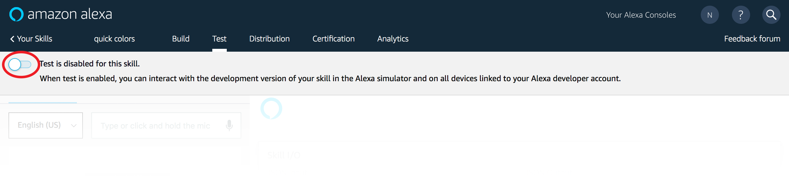

# AWS & ASK CLI Setup Guide
[AWS Account](new-aws-account.md) | [AWS CLI](aws-cli-setup-intro.md) | [AWS CLI Profile](aws-cli-setup-profile.md) | [Amazon Developer Account](dev-portal-intro.md) | [ASK CLI](ask-cli-setup-intro.md) | [ASK CLI Profile](ask-cli-setup-profile.md) | **[Deploy a Skill](deploy-sample-skill.md)**


# Create your first skill for Echo Buttons


If you are here it means that you have:

✓ **An AWS Account** (if not, follow the [guide to Create a new AWS Account](new-aws-account.md))

✓ **The AWS CLI Installed** (if not, follow the [guide to install AWS CLI](aws-cli-setup-install.md))

✓ **An Amazon Developer Account** (if not, follow the [guide to Create a new Amazon Developer Account](new-dev-portal-account.md))

✓ **The ASK CLI Installed** (if not, follow the [guide to install ASK CLI](ask-cli-setup-install.md))

✓ **An ASK CLI Profile** (if not, follow the [guide to setup a ASK CLI Profile](ask-cli-setup-profile.md))


The sample uses

- The [Node.js](https://nodejs.org/en/) framework for the skill code (using **Alexa Skills Kit (ASK) SDK for Node.js**)
- **AWS Lambda** to host the skill


## 1 – Create a new skill

In this step, you will get a copy of the sample skill code on your local computer and prepare a deployment package (a zip file that you create out of the Hello World skill code) to upload to Lambda in the next step. 

1. Initialize the ASK CLI

```bash
ask new
```

It will ask you for a skill name, choose whatever (e.g. hello-world)


```bash
cd hello-world
```

​       

## 2 – Deploy The Sample Skill to Your Account

Once the ASK CLI is configured, it will create the skill and associated Lambda function. 

Deploy the skill and associated function with the following command: 

```bash
ask deploy
```


## 3 – Test the Skill

> **Reminder: Setup your Echo Buttons** 
> You can say, “Alexa setup my echo buttons,” 

The skill can be invoked and tested on an Echo device with Echo Buttons. 

1. Login to the [Alexa Developer Console](https://developer.amazon.com/alexa/console/ask).

2. Find your new skill in the Skills list, and select **Edit**.

   

3. Click the **Test** tab.

   

4. Enable Test for the skill by clicking the **Test** switch in the top left. 

   

Now you can use any Echo device logged in to the same developer account to test the skill: 

​     *“Alexa, open hello world.”*


##  🏆 **Congratulations** - You Have Completed The AWS/CLI Setup Guide! 🏆

