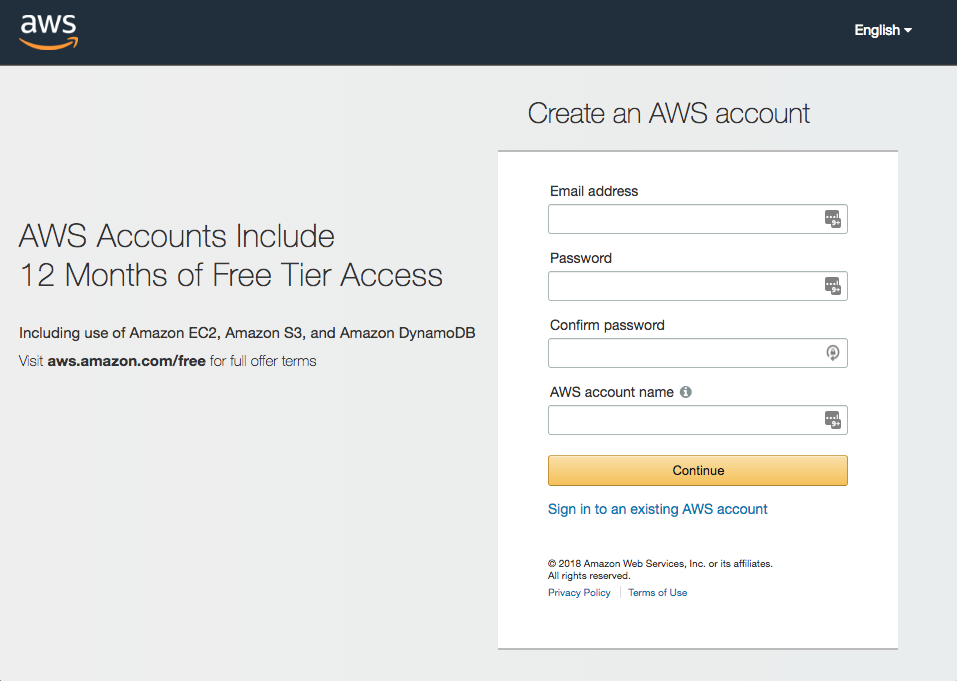

# AWS & ASK CLI Setup Guide
**[AWS Account](new-aws-account.md)** | [AWS CLI](aws-cli-setup-intro.md) | [AWS CLI Profile](aws-cli-setup-profile.md) | [Amazon Developer Account](dev-portal-intro.md) | [ASK CLI](ask-cli-setup-intro.md) | [ASK CLI Profile](ask-cli-setup-profile.md) | [Deploy a Skill](deploy-sample-skill.md)

## Create a New AWS Account

Amazon Web Service (AWS) is a secure cloud services platform, offering compute power, database storage, content delivery and other functionality to help businesses scale and grow. AWS makes it very easy to build and deploy Alexa Skills in the cloud without having to worry about provisioning or maintaining infrastructure.

This guide will walk you through the 4 step process of setting up a new Amazon AWS account. 

If you already have an AWS account you can go to the next step and [Setup AWS CLI](aws-cli-setup-intro.md)

#### Overview

1. 📨 Create your Account
2. 💳 Add A Payment Method
3. 📞 Verify Phone Number
4. 💁 Choose an AWS Support Plan 

You will need: a valid **email address** 📨, a working **phone number ** 📞, and a valid **credit card** 💳. 

**Note**: Amazon AWS provides sufficient functionality in the free tier for developing skills. You will not be charged anything for following the guides today and in general to develop and test skills, however you do need to have a valid credit card on file in order to activate an AWS account.

#### Step 1 - Create Your Account

1. Go to the [Amazon Web Services home page](https://portal.aws.amazon.com/billing/signup).

2. Choose **Sign Up**.

   **Note:** If you've signed in to AWS recently, it might say **Sign In to the Console**.

   

3. Type the requested account information, and then choose **Continue**.
   **Note:** If **Create a new AWS account** isn't visible, first choose **Sign in to a different account**, and then choose **Create a new AWS account**. When creating a new account, be sure that you enter your account information correctly, especially your email address. If you enter your email address incorrectly, you might not be able to access your account or change your password in the future.

4. Choose **Personal** or **Professional**.
   **Note:** These two account types are identical in functionality. 
   AWS Accounts are free. Feel free to create a personal account to explore the functionality.

5. Type the requested company or personal information.

6. Read the [AWS Customer Agreement](https://aws.amazon.com/agreement/), and then check the box.

7. Choose **Create Account and Continue**.

**Note:** After you receive an email to confirm that your account is created, you can sign in to your new account using the email address and password you supplied. However, you must continue with the activation process before you can use AWS services.

#### Step 2 - Payment Method

On the **Payment Information** page, type the requested information associated with your payment method. If the address for your payment method is the same as the address you provided for your account, choose **Secure Submit**.

Otherwise, choose **Use a new address**, type the billing address for your payment method, and then choose **Secure Submit**.

#### Step 3 - Verify Your Phone Number

1. On the **Phone Verification** page, type a phone number that you can use to accept incoming phone calls.

2. Enter the code displayed in the captcha.

3. When you're ready to receive a call, choose **Call me now**. In a few moments, an automated system will call you.

4. Type the provided PIN on your phone's keypad. After the process is complete, choose **Continue**.

   

#### Step 4 - Select Support Option

On the **Select a Support Plan** page, choose one of the available Support plans. For a description of the available Support plans and their benefits, see [AWS Support - Features](https://aws.amazon.com/premiumsupport/features/).

After you choose a Support plan, a confirmation page indicates that your account is being activated. Accounts are usually activated within a few minutes, but the process might take up to 24 hours.

**Note:** You can sign in to your AWS account during this time. The AWS home page might continue to display a button that shows "Complete Sign Up" during this time, even if you've completed all the steps in the sign-up process.

When your account is fully activated, you'll receive a confirmation email. After you receive this email, you have full access to all AWS services.

Proceed to log in to your new account!

#### Online References:

https://aws.amazon.com/premiumsupport/knowledge-center/create-and-activate-aws-account/

## Continue to [AWS CLI Setup](aws-cli-setup-intro.md)

